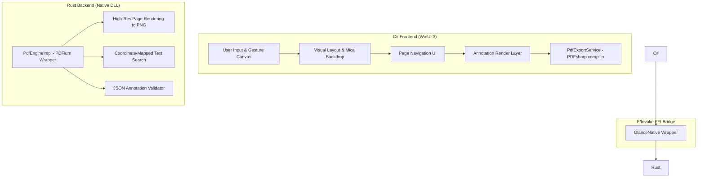
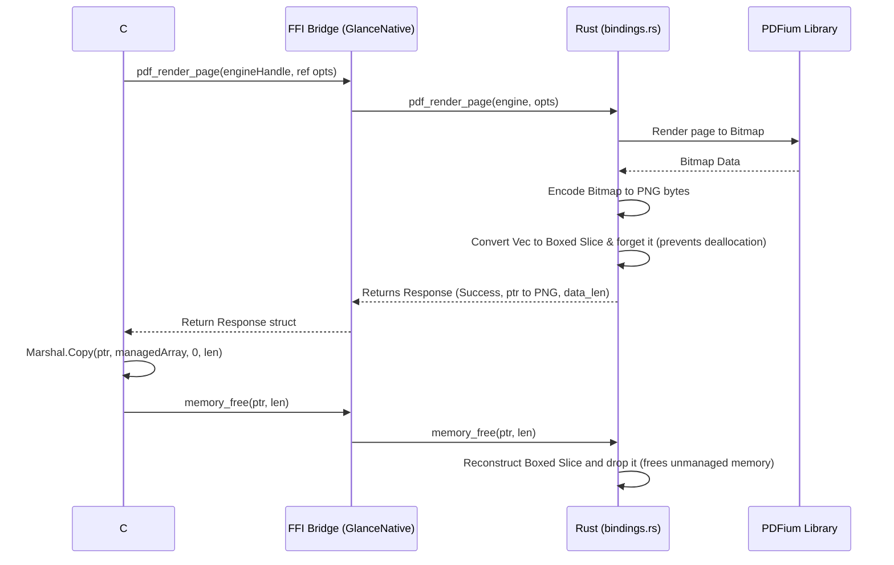

# Hybrid C# ↔ Rust Integration Model

Glance implements a **hybrid architecture** that balances C# development speed with Rust native speed. This document describes the integration plan, architectural boundaries, and unmanaged data flow (marshalling) between the two layers.

---

## 1. Boundary of Responsibilities

To maintain clean separation, each language focuses on what it does best:



### C# Layer (Frontend & Aesthetics)
*   **User Interface:** Window shell, panels, toolbars, dialogs, sliders, and navigation lists.
*   **Input Processing:** Canvas gestures, drawing strokes tracking, ink rendering, and drag-and-drop.
*   **Application Settings:** System theme styling, and local persistent configurations.
*   **Orchestration:** Deciding when to render pages, save files, or perform searches.

### Rust Layer (Performance & Engine)
*   **PDF Parsing:** Offloaded to Google's PDFium library.
*   **Rasterization:** Generating high-resolution PNG image buffers from PDF pages.
*   **Text Processing:** Scanning, extracting, and matching text queries with coordinates.
*   **Validation:** Parsing, indexing, and validating annotation schemas.

---

## 2. P/Invoke Bridge Implementation

Inter-process communication uses standard C-style FFI bindings via .NET Platform Invoke (P/Invoke).

### Shared Memory Structs
Both languages must share identical memory structures. We specify `#[repr(C)]` in Rust and `[StructLayout(LayoutKind.Sequential)]` in C#.

#### Render Options Layout
*   **Rust Struct:**
    ```rust
    #[repr(C)]
    pub struct RenderOptions {
        pub page_index: u32,
        pub width: u32,
        pub height: u32,
        pub dpi: f32,
    }
    ```
*   **C# Struct:**
    ```csharp
    [StructLayout(LayoutKind.Sequential)]
    public struct RenderOptions
    {
        public uint PageIndex;
        public uint Width;
        public uint Height;
        public float Dpi;
    }
    ```

#### Native Response Wrapper
All FFI operations return a unified response to handle success status and errors safely:
*   **Rust Struct:**
    ```rust
    #[repr(C)]
    pub struct Response {
        pub success: bool,
        pub error_msg: *const u8,
        pub data_ptr: *mut u8,
        pub data_len: u64,
    }
    ```
*   **C# Struct:**
    ```csharp
    [StructLayout(LayoutKind.Sequential)]
    public struct Response
    {
        [MarshalAs(UnmanagedType.U1)]
        public bool Success;
        public IntPtr ErrorMsg;
        public IntPtr DataPtr;
        public ulong DataLen;
    }
    ```

---

## 3. Data Flow & Marshalling Life Cycle

Here is the exact lifecycle of an FFI call (e.g., rendering a page):



---

## 4. Memory Ownership Policies

To prevent memory leaks and crashes, Glance follows three rules:

1.  **Rust Allocates, Rust Frees:** C# must never attempt to free pointers allocated by Rust using C#’s `Marshal.FreeHGlobal` or `coTaskMemFree`. All unmanaged pointers must be returned to Rust via `memory_free`.
2.  **Explicit Lifetime Forgetting:** When Rust returns an allocated buffer (PNG bytes or a JSON string) to C#, it must invoke `std::mem::forget` (or `Box::into_raw`/`CString::into_raw`) to tell the compiler not to drop it when the FFI function exits.
3.  **Correct Deallocation Strategy:**
    *   C-style strings (`len == 0`) must be freed via `CString::from_raw`.
    *   Arbitrary byte buffers (`len > 0`) must be freed via `Box::from_raw` using the exact `len` as capacity to prevent allocator corruption.
